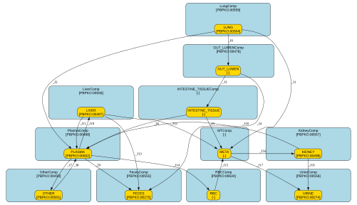

# pbk_cd_gastellu_2026_revised

## Creators

*not specified*

## Overview

| key                          | value                                         |
|:-----------------------------|:----------------------------------------------|
| Modelled species/orgamism(s) | http://purl.obolibrary.org/obo/NCBITaxon_9606 |
| Model chemical(s)            | http://purl.obolibrary.org/obo/CHEBI_22978    |
| Input route(s)               | 1 (inhalation)                                |
| Time resolution              | d                                             |
| Amounts unit                 | ug                                            |
| Volume unit                  | L                                             |
| Number of compartments       | 11                                            |
| Number of species            | 11                                            |
| Number of parameters         | 81 (29 external / 52 internal)                |

## Diagram

## Compartments

| id                   | name                          | unit   | model qualifier                            |
|:---------------------|:------------------------------|:-------|:-------------------------------------------|
| LungComp             | lung compartment              | L      | http://purl.obolibrary.org/obo/PBPKO_00559 |
| GUT_LUMENComp        | gut lumen compartment         | L      | http://purl.obolibrary.org/obo/PBPKO_00478 |
| INTESTINE_TISSUEComp | intestinal tissue compartment | L      | *not specified*                            |
| PlasmaComp           | plasma compartment            | L      | http://purl.obolibrary.org/obo/PBPKO_00488 |
| RBCComp              | red blood cell compartment    | L      | http://purl.obolibrary.org/obo/PBPKO_00634 |
| MTComp               | Metallothionein compartment   | L      | *not specified*                            |
| LiverComp            | liver compartment             | L      | http://purl.obolibrary.org/obo/PBPKO_00558 |
| KidneyComp           | kidney compartment            | L      | http://purl.obolibrary.org/obo/PBPKO_00557 |
| OtherComp            | rest of body compartment      | L      | http://purl.obolibrary.org/obo/PBPKO_00450 |
| FecesComp            | feces compartment             | L      | http://purl.obolibrary.org/obo/PBPKO_00555 |
| UrineComp            | urine compartment             | L      | http://purl.obolibrary.org/obo/PBPKO_00556 |

## Species

| id               | name                        | unit   | model qualifier                            |
|:-----------------|:----------------------------|:-------|:-------------------------------------------|
| LUNG             | amount in lung              | ug     | http://purl.obolibrary.org/obo/PBPKO_00504 |
| GUT_LUMEN        | amount in lumen             | ug     | *not specified*                            |
| INTESTINE_TISSUE | amount in intestinal tissue | ug     | *not specified*                            |
| PLASMA           | amount in plasma            | ug     | http://purl.obolibrary.org/obo/PBPKO_00502 |
| RBC              | amount in red blood cells   | ug     | *not specified*                            |
| META             | amount in metallothionein   | ug     | *not specified*                            |
| LIVER            | amount in liver             | ug     | http://purl.obolibrary.org/obo/PBPKO_00497 |
| KIDNEY           | amount in kidney            | ug     | http://purl.obolibrary.org/obo/PBPKO_00498 |
| OTHER            | amount in restbody          | ug     | http://purl.obolibrary.org/obo/PBPKO_00501 |
| FECES            | cumulative amount in feces  | ug     | http://purl.obolibrary.org/obo/PBPKO_00275 |
| URINE            | cumulative amount in urine  | ug     | http://purl.obolibrary.org/obo/PBPKO_00274 |

## Transfer equations

| id   | from             | to               | equation                           |
|:-----|:-----------------|:-----------------|:-----------------------------------|
| _J0  | LUNG             | GUT_LUMEN        | k4 * LUNG                          |
| _J1  | LUNG             | META             | uptakeMT_Lung                      |
| _J2  | LUNG             | PLASMA           | uptakePlasma_Lung                  |
| _J3  | GUT_LUMEN        | INTESTINE_TISSUE | k5_active * kabs * GUT_LUMEN       |
| _J4  | GUT_LUMEN        | FECES            | (1 - k5_active) * kabs * GUT_LUMEN |
| _J5  | INTESTINE_TISSUE | META             | uptakeMT_GI                        |
| _J6  | INTESTINE_TISSUE | PLASMA           | uptakePlasma_GI                    |
| _J7  | PLASMA           | OTHER            | k9 * PLASMA                        |
| _J8  | OTHER            | PLASMA           | k10 * OTHER                        |
| _J9  | PLASMA           | FECES            | k11 * PLASMA                       |
| _J10 | PLASMA           | LIVER            | k12 * PLASMA                       |
| _J11 | LIVER            | PLASMA           | k13 * LIVER                        |
| _J12 | LIVER            | META             | k14 * LIVER                        |
| _J13 | LIVER            | FECES            | k15 * LIVER                        |
| _J14 | PLASMA           | RBC              | kx * PLASMA                        |
| _J15 | RBC              | META             | k16 * RBC                          |
| _J16 | META             | KIDNEY           | k_MT_out * k17x * META             |
| _J17 | META             | URINE            | k_MT_out * k17b * META             |
| _J18 | KIDNEY           | PLASMA           | k18 * KIDNEY                       |
| _J19 | KIDNEY           | URINE            | k19x * KIDNEY                      |

## ODEs

| species          | equation                                                                                                                                                                                                                                                                |
|:-----------------|:------------------------------------------------------------------------------------------------------------------------------------------------------------------------------------------------------------------------------------------------------------------------|
| LUNG             | d[LUNG]/dt = - k4 * LUNG             - uptakeMT_Lung             - uptakePlasma_Lung                                                                                                                                                                                    |
| GUT_LUMEN        | d[GUT_LUMEN]/dt = k4 * LUNG                  - k5_active * kabs * GUT_LUMEN                  - (1 - k5_active) * kabs * GUT_LUMEN                                                                                                                                       |
| INTESTINE_TISSUE | d[INTESTINE_TISSUE]/dt = k5_active * kabs * GUT_LUMEN                         - uptakeMT_GI                         - uptakePlasma_GI                                                                                                                                   |
| PLASMA           | d[PLASMA]/dt = uptakePlasma_Lung               + uptakePlasma_GI               - k9 * PLASMA               + k10 * OTHER               - k11 * PLASMA               - k12 * PLASMA               + k13 * LIVER               - kx * PLASMA               + k18 * KIDNEY |
| RBC              | d[RBC]/dt = kx * PLASMA            - k16 * RBC                                                                                                                                                                                                                          |
| META             | d[META]/dt = uptakeMT_Lung             + uptakeMT_GI             + k14 * LIVER             + k16 * RBC             - k_MT_out * k17x * META             - k_MT_out * k17b * META                                                                                        |
| LIVER            | d[LIVER]/dt = k12 * PLASMA              - k13 * LIVER              - k14 * LIVER              - k15 * LIVER                                                                                                                                                             |
| KIDNEY           | d[KIDNEY]/dt = k_MT_out * k17x * META               - k18 * KIDNEY               - k19x * KIDNEY                                                                                                                                                                        |
| OTHER            | d[OTHER]/dt = k9 * PLASMA              - k10 * OTHER                                                                                                                                                                                                                    |
| FECES            | d[FECES]/dt = (1 - k5_active) * kabs * GUT_LUMEN              + k11 * PLASMA              + k15 * LIVER                                                                                                                                                                 |
| URINE            | d[URINE]/dt = k_MT_out * k17b * META              + k19x * KIDNEY                                                                                                                                                                                                       |

## Assignment rules

| variable          | assignment                                                                                                                                                                  |
|:------------------|:----------------------------------------------------------------------------------------------------------------------------------------------------------------------------|
| year              | time / 365 + Age                                                                                                                                                            |
| BWNominal         | piecewise(BW_male_lifetime(AgeRef * 12), eq(sex, 1), BW_female_lifetime(AgeRef * 12))                                                                                       |
| Delta_BWs3        | BWRef / BWNominal                                                                                                                                                           |
| Delta_BW          | piecewise(1 + (Delta_BWs3 - 1) * year * 365 / 1095, leq(year * 365, 1095), Delta_BWs3)                                                                                      |
| BW_male           | piecewise(BW_male_lifetime(year * 12) * Delta_BW, leq(year, 79), 76 * Delta_BW)                                                                                             |
| BW_female         | piecewise(BW_female_lifetime(year * 12) * Delta_BW, leq(year, 79), 68 * Delta_BW)                                                                                           |
| wbw               | piecewise(BW_male, eq(sex, 1), BW_female)                                                                                                                                   |
| hct_mid           | 1.12815e-6 * pow(year, 3) - 0.000172362 * pow(year, 2) + 0.00815264 * year + 0.327363                                                                                       |
| hct               | piecewise(0.359, leq(year, 2), hct_mid, lt(year, 18), 0.4248446)                                                                                                            |
| vb_male           | piecewise((-0.027 * year + 0.077) * wbw, lt(year, 1), 0.0761 / (1 + exp(-0.683 * year + 0.946)) * wbw)                                                                      |
| vb_female         | piecewise((-0.0273 * year + 0.0771) * wbw, lt(year, 1), (3.28e-5 * pow(year, 3) - 0.00121 * pow(year, 2) + 0.0124 * year + 0.0386) * wbw, lt(year, 14.019723), 0.065 * wbw) |
| vb                | piecewise(vb_male, eq(sex, 1), vb_female)                                                                                                                                   |
| vp                | (1 - hct) * vb                                                                                                                                                              |
| vrbc              | hct * vb                                                                                                                                                                    |
| vk_male           | piecewise((0.0042 + (0.00767 - 0.0042) * exp(-0.206 * year)) * wbw, leq(year, 79), (0.0042 + 2.969074e-10) * wbw)                                                           |
| vk_female         | piecewise((0.0046 + (0.00709 - 0.0046) * exp(-0.221 * year)) * wbw, leq(year, 79), (0.0046 + 6.514063e-11) * wbw)                                                           |
| vk                | piecewise(vk_male, eq(sex, 1), vk_female)                                                                                                                                   |
| vlungs            | piecewise(0.0068 * wbw, eq(sex, 1), 0.007 * wbw)                                                                                                                            |
| vint_male         | piecewise((-8.2562e-5 * pow(year, 2) + 0.0013523 * year + 0.01293) * wbw, lt(year, 16), 0.014 * wbw)                                                                        |
| vint_female       | piecewise((-7.421e-5 * pow(year, 2) + 0.001276 * year + 0.01298) * wbw, lt(year, 14.453301), 0.016 * wbw)                                                                   |
| vintestine        | piecewise(vint_male, eq(sex, 1), vint_female)                                                                                                                               |
| vl_male           | piecewise((0.0247 + (0.0409 - 0.0247) * exp(-0.218 * year)) * wbw, leq(year, 79), (0.0247 + 5.371498e-10) * wbw)                                                            |
| vl_female         | piecewise((0.0233 + (0.038 - 0.0233) * exp(-0.122 * year)) * wbw, leq(year, 79), (0.0233 + 9.58489e-7) * wbw)                                                               |
| vl                | piecewise(vl_male, eq(sex, 1), vl_female)                                                                                                                                   |
| vother            | wbw - (vk + vb + vl + vintestine + vlungs)                                                                                                                                  |
| wbw_f             | vk + vb + vl + vintestine + vlungs + vother                                                                                                                                 |
| ucr_base          | 0.032 + 0.02098 * year + 0.009104 * pow(year, 2) - 0.000455 * pow(year, 3) + 7.578e-6 * pow(year, 4) - 4.232e-8 * pow(year, 5)                                              |
| ucr               | piecewise(ucr_base * Delta_creat, leq(year, 70), 0.865756 * Delta_creat)                                                                                                    |
| Vurine            | 0.0294 * wbw_f                                                                                                                                                              |
| k5_active         | piecewise(k5_h, eq(sex, 1), k5_f)                                                                                                                                           |
| k19x              | piecewise(k19, leq(year, 30), k19 + k21 * (year - 30))                                                                                                                      |
| k17_decline       | k17 - k17 / 3 * (year - 30) / 50                                                                                                                                            |
| k17x              | piecewise(k17, leq(year, 30), 0, lt(k17_decline, 0), k17_decline)                                                                                                           |
| k17b              | 1 - k17x                                                                                                                                                                    |
| wbw0              | piecewise(3.938425, eq(sex, 1), 3.932403)                                                                                                                                   |
| vb0               | piecewise(0.077 * wbw0, eq(sex, 1), 0.0771 * wbw0)                                                                                                                          |
| Acord_total       | Ccord * vb0                                                                                                                                                                 |
| uptakeTotal_Lung  | k3 * LUNG                                                                                                                                                                   |
| uptakeTotal_GI    | k6 * INTESTINE_TISSUE                                                                                                                                                       |
| TOTAL_UPTAKE      | uptakeTotal_Lung + uptakeTotal_GI                                                                                                                                           |
| UPTAKE_MT_SMOOTH  | 0.01 * k8                                                                                                                                                                   |
| UPTAKE_MT         | k7 * TOTAL_UPTAKE + (k8 - k7 * TOTAL_UPTAKE) / (1 + exp((k8 - k7 * TOTAL_UPTAKE) / UPTAKE_MT_SMOOTH))                                                                       |
| UPTAKE_PLASMA     | TOTAL_UPTAKE - UPTAKE_MT                                                                                                                                                    |
| uptakeMT_Lung     | piecewise(0, leq(TOTAL_UPTAKE, 0), UPTAKE_MT * uptakeTotal_Lung / TOTAL_UPTAKE)                                                                                             |
| uptakeMT_GI       | piecewise(0, leq(TOTAL_UPTAKE, 0), UPTAKE_MT * uptakeTotal_GI / TOTAL_UPTAKE)                                                                                               |
| uptakePlasma_Lung | uptakeTotal_Lung - uptakeMT_Lung                                                                                                                                            |
| uptakePlasma_GI   | uptakeTotal_GI - uptakeMT_GI                                                                                                                                                |
| BLOOD             | RBC + k20 * (PLASMA + META)                                                                                                                                                 |
| BLOOD_burden      | BLOOD / vb                                                                                                                                                                  |
| ur                | k_MT_out * k17b * META + k19x * KIDNEY                                                                                                                                      |
| Conc_urine_cd     | ur / Vurine                                                                                                                                                                 |
| ucdcr             | ur / ucr                                                                                                                                                                    |

## Initial assignments

| variable   | assignment   |
|:-----------|:-------------|
| RBC        | Acord_total  |

## Function definitions

| function           | definition                                                                                                                                                                                                                                                                                                                                                                   |
|:-------------------|:-----------------------------------------------------------------------------------------------------------------------------------------------------------------------------------------------------------------------------------------------------------------------------------------------------------------------------------------------------------------------------|
| BW_male_lifetime   | BW_male_lifetime(mval) = lambda(mval, 3.938425 + 0.7518199 * mval - 0.02023793 * pow(mval, 2) + 0.0002921682 * pow(mval, 3) - 2.06762e-6 * pow(mval, 4) + 8.469e-9 * pow(mval, 5) - 2.188427e-11 * pow(mval, 6) + 3.699776e-14 * pow(mval, 7) - 4.099077e-17 * pow(mval, 8) + 2.874804e-20 * pow(mval, 9) - 1.159732e-23 * pow(mval, 10) + 2.052602e-27 * pow(mval, 11))     |
| BW_female_lifetime | BW_female_lifetime(mval) = lambda(mval, 3.932403 + 0.6866462 * mval - 0.01949911 * pow(mval, 2) + 0.00031311 * pow(mval, 3) - 2.466654e-6 * pow(mval, 4) + 1.113217e-8 * pow(mval, 5) - 3.131402e-11 * pow(mval, 6) + 5.693737e-14 * pow(mval, 7) - 6.706947e-17 * pow(mval, 8) + 4.947858e-20 * pow(mval, 9) - 2.079251e-23 * pow(mval, 10) + 3.800367e-27 * pow(mval, 11)) |

## Parameters

| id                | name                                                                                       | unit            | model qualifier                            |
|:------------------|:-------------------------------------------------------------------------------------------|:----------------|:-------------------------------------------|
| k3                | First-order transfer rate constant from lung to total systemic uptake                      | /d              | *not specified*                            |
| k4                | First-order transfer rate constant from lung to GI                                         | /d              | *not specified*                            |
| kabs              | First-order absorption rate constant                                                       | /d              | *not specified*                            |
| k5_h              | Fraction of absorbed Cd in gut transferred to intestine in males                           | dimensionless   | *not specified*                            |
| k5_f              | Fraction of absorbed Cd in gut transferred to intestine in females                         | dimensionless   | *not specified*                            |
| k6                | First-order transfer rate constant from intestine to total systemic uptake                 | /d              | *not specified*                            |
| k7                | Fraction of total systemic Cd uptake to the metallothionein                                | dimensionless   | *not specified*                            |
| k8                | Maximum Cd flux into the metallothionein                                                   | ug/d            | *not specified*                            |
| k_MT_out          | First-order turnover rate constant for MT-bound Cd (added explicitly for unit consistency) | /d              | *not specified*                            |
| k9                | kinetic constant rate PLASMA -> OTHER tissues                                              | /d              | *not specified*                            |
| k10               | kinetic constant rate OTHER tissues -> PLASMA                                              | /d              | *not specified*                            |
| k11               | kinetic constant rate PLASMA -> feces                                                      | /d              | *not specified*                            |
| k12               | kinetic constant rate PLASMA -> liver                                                      | /d              | *not specified*                            |
| k13               | kinetic constant rate liver -> PLASMA                                                      | /d              | *not specified*                            |
| k14               | kinetic constant rate liver -> MT pool                                                     | /d              | *not specified*                            |
| k15               | kinetic constant rate liver -> feces                                                       | /d              | *not specified*                            |
| kx                | kinetic constant rate PLASMA -> RBC                                                        | /d              | *not specified*                            |
| k16               | kinetic constant rate RBC-> MT pool                                                        | /d              | *not specified*                            |
| k17               | Fraction of MT-bound Cd removal to KIDNEY; remainder goes directly to urine.               | dimensionless   | *not specified*                            |
| k18               | kinetic constant rate KIDNEY -> PLASMA                                                     | /d              | *not specified*                            |
| k19               | urine elimination rate constant                                                            | /d              | *not specified*                            |
| k21               | Age-dependent increase in kidney-to-urine elimination after age 30                         | /y              | *not specified*                            |
| k20               | Fraction of PLASMA + META Cd amounts to calculated whole-blood Cd                          | dimensionless   | *not specified*                            |
| Age               | Age of the individual at start of simulation                                               | y               | *not specified*                            |
| AgeRef            | Reference age used for scaling of nominal body weight to reference body weight             | y               | *not specified*                            |
| sex               | sex discrimination                                                                         | dimensionless   | *not specified*                            |
| year              | Age in years                                                                               | y               | http://purl.obolibrary.org/obo/PBPKO_00521 |
| BWRef             | Body weight of individual at reference age                                                 | kg              | *not specified*                            |
| BWNominal         | *not specified*                                                                            | *not specified* | *not specified*                            |
| Delta_BWs3        | Individual body-weight multiplier reached at reference age                                 | dimensionless   | *not specified*                            |
| Delta_BW          | Age-dependent body-weight multiplier (1 at birth; Delta_BWs3 from age 3)                   | dimensionless   | *not specified*                            |
| Ccord             | Measured Cd concentration in cord whole blood used to initialize birth Cd amount           | ug/d            | *not specified*                            |
| BW_male           | measured bodyweight for male participiant                                                  | kg              | http://purl.obolibrary.org/obo/PBPKO_00008 |
| BW_female         | measured bodyweight for female participiant                                                | kg              | http://purl.obolibrary.org/obo/PBPKO_00008 |
| wbw               | bodyweight for the selected sex and age                                                    | kg              | http://purl.obolibrary.org/obo/PBPKO_00008 |
| hct_mid           | Predicted hematocrit in the age-dependent (ages 2–18 years)                                | dimensionless   | *not specified*                            |
| hct               | age-specific hematocrit fraction                                                           | dimensionless   | *not specified*                            |
| vb_male           | Male whole-blood volume or mass calculated from body weight                                | L               | http://purl.obolibrary.org/obo/PBPKO_00108 |
| vb_female         | Female whole-blood volume or mass calculated from body weight                              | L               | http://purl.obolibrary.org/obo/PBPKO_00108 |
| vb                | whole blood volume                                                                         | L               | http://purl.obolibrary.org/obo/PBPKO_00108 |
| vp                | volume of plasma                                                                           | L               | http://purl.obolibrary.org/obo/PBPKO_00103 |
| vrbc              | volume of red blood cells                                                                  | L               | *not specified*                            |
| vk_male           | Male kidney volume                                                                         | L               | http://purl.obolibrary.org/obo/PBPKO_00079 |
| vk_female         | Female kidney volume                                                                       | L               | http://purl.obolibrary.org/obo/PBPKO_00079 |
| vk                | volume of kidney                                                                           | L               | http://purl.obolibrary.org/obo/PBPKO_00079 |
| vlungs            | volume of lung                                                                             | L               | http://purl.obolibrary.org/obo/PBPKO_00097 |
| vint_male         | volume of male intestine                                                                   | L               | http://purl.obolibrary.org/obo/PBPKO_00069 |
| vint_female       | volume of female intestine                                                                 | L               | http://purl.obolibrary.org/obo/PBPKO_00069 |
| vintestine        | volume of intestine                                                                        | L               | http://purl.obolibrary.org/obo/PBPKO_00069 |
| vl_male           | volume of male liver                                                                       | L               | http://purl.obolibrary.org/obo/PBPKO_00077 |
| vl_female         | volume of female liver                                                                     | L               | http://purl.obolibrary.org/obo/PBPKO_00077 |
| vl                | volume of liver                                                                            | L               | http://purl.obolibrary.org/obo/PBPKO_00077 |
| vother            | volume of rest body                                                                        | L               | http://purl.obolibrary.org/obo/PBPKO_00105 |
| wbw_f             | Caculated body weight from organ volumes                                                   | L               | http://purl.obolibrary.org/obo/PBPKO_00008 |
| Delta_creat       | Individual multiplicative adjustment to predicted urine creatinine output                  | dimensionless   | *not specified*                            |
| ucr_base          | Reference creatinine output before Delta_creat adjustment                                  | g/d             | *not specified*                            |
| ucr               | Age-dependent creatinine output after Delta_creat adjustment                               | g/d             | *not specified*                            |
| Vurine            | predicted urine volume                                                                     | L/d             | *not specified*                            |
| k5_active         | sex-specific gut:intestine fraction                                                        | dimensionless   | *not specified*                            |
| k19x              | age-adjusted kidney:urine rate                                                             | /d              | *not specified*                            |
| k17_decline       | age-related changes of k17                                                                 | dimensionless   | *not specified*                            |
| k17x              | age-adjusted MT removal fraction to kidney                                                 | dimensionless   | *not specified*                            |
| k17b              | MT removal fraction to urine                                                               | dimensionless   | *not specified*                            |
| wbw0              | bodyweight at birth                                                                        | kg              | http://purl.obolibrary.org/obo/PBPKO_00008 |
| vb0               | volume of whole blood at birth                                                             | L               | http://purl.obolibrary.org/obo/PBPKO_00108 |
| Acord_total       | initial Cd amound from measured cord whole blood                                           | ug              | *not specified*                            |
| uptakeTotal_Lung  | Systemic Cd uptake flux from lung                                                          | ug/d            | *not specified*                            |
| uptakeTotal_GI    | Systemic Cd uptake flux from intestine                                                     | ug/d            | *not specified*                            |
| TOTAL_UPTAKE      | Sum of lung and GI systemic uptake fluxes                                                  | ug/d            | *not specified*                            |
| UPTAKE_MT_SMOOTH  | *not specified*                                                                            | *not specified* | *not specified*                            |
| UPTAKE_MT         | Remaining systemic Cd uptake flux to MT                                                    | ug/d            | *not specified*                            |
| UPTAKE_PLASMA     | Remaining systemic Cd uptake flux to plasma                                                | ug/d            | *not specified*                            |
| uptakeMT_Lung     | Lung contribution to MT uptake flux, allocated in proportion to lung share of total uptake | ug/d            | *not specified*                            |
| uptakeMT_GI       | GI contribution to MT uptake flux, allocated in proportion to GI share of total uptake     | ug/d            | *not specified*                            |
| uptakePlasma_Lung | Lung contribution to plasma uptake flux                                                    | ug/d            | *not specified*                            |
| uptakePlasma_GI   | GI contribution to plasma uptake flux                                                      | ug/d            | *not specified*                            |
| BLOOD             | amount in whole blood                                                                      | ug              | http://purl.obolibrary.org/obo/PBPKO_00623 |
| BLOOD_burden      | concentration in whole blood                                                               | ug/L            | http://purl.obolibrary.org/obo/PBPKO_00301 |
| ur                | urinary clearance rate                                                                     | ug/d            | http://purl.obolibrary.org/obo/PBPKO_00232 |
| Conc_urine_cd     | concentration in urine                                                                     | ug/L            | http://purl.obolibrary.org/obo/PBPKO_00302 |
| ucdcr             | Urinary concentration normalized to creatinine (ug/g creatine)                             | ug/g            | http://purl.obolibrary.org/obo/PBPKO_00302 |

